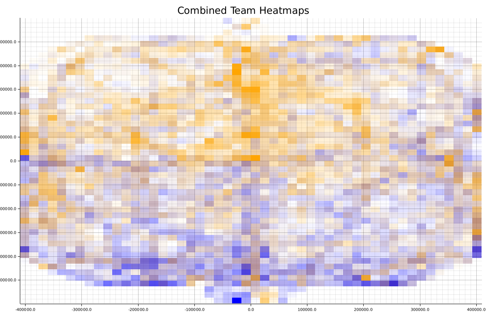
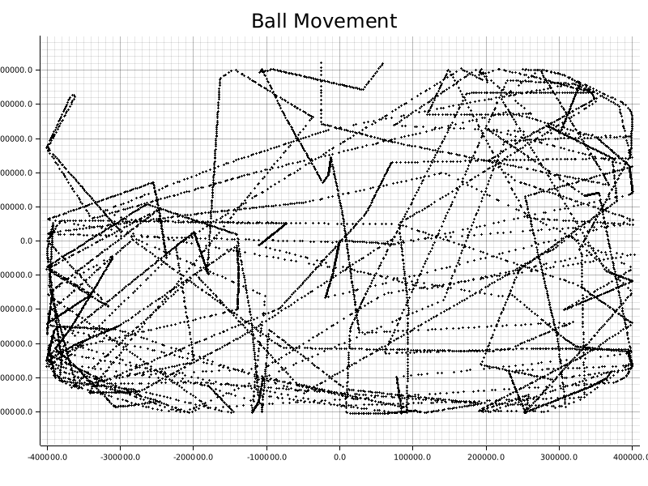

# Rattlebrain Replay Analysis

## OpenAI response

 Based on the provided data and analysis requests, here's a comprehensive breakdown of the Rocket League team's performance, highlighting areas for improvement in strategy, mechanics, and decision-making:

### Strategy Analysis:
1. **Team Positioning and Rotations**: 
   - Team 0 seems to have executed their offensive strategies well, as evident from the two goals scored by ALSYG and tender. 
   - It's important to ensure that there's always a player ready to follow up on offensive plays or rotate back quickly to defense. 
   - The defensive rotations, however, show room for improvement. ALSYG made a notable contribution with a save, but the other team members could assist more on defense.
   
2. **Overall Synergy**: 
   - ALSYG and tender are notable contributors with goals and assists, hinting at a potential synergy between them. Working on consistent communication and ensuring every player's positioning complements others will improve overall synergy.
   - Team 1 didn't score; a review of their positioning relative to each other and their opponents might reveal opportunities for better collaboration and enhancement of offensive plays.

### Mechanics Analysis:
1. **Boost Efficiency**:
   - None of the players had a particularly high score, indicating room for improvement in boost management. Ensuring players are constantly aware of boost pads and their usage can help maintain speed and positional advantage.
   
2. **Aerial Control**:
   - With minimal aerial engagement recorded through highlights, players should focus on practicing aerials to close gaps between ground play and aerials for better ball control and contesting balls in mid-air.

3. **Shot Accuracy**:
   - Although ALSYG and tender scored, their shot attempts weren't high. Encouraging players to take more shots can increase scoring opportunities. Practice drills focusing on shooting accuracy under pressure will be beneficial.

### Decision-Making Analysis:
1. **Situational Awareness**:
   - Players should work on being more aware of the game's current state (score, timer, boost levels) and adjust their aggression and defensive stance accordingly.
   - Regular review of game replays can help identify missed opportunities or unnecessary risks taken during the match.

2. **Risk/Reward Trade-offs**:
   - Players need to evaluate the risks involved in challenging opponents or leaving goal positions open. 
   - Emphasize strategic retreat to defense after offensive plays, especially when a teammate commits to a ball in a risky area.
   
3. **Insights on Defending and Counter-Attacking**:
   - The team should work on transitioning from defense to counter-attacks, capitalizing quickly on turnovers by the opponent.
   - Establishing roles in defense such as first defender challenge, second man cover, and third man shadow can help maintain structure and security.

In summary, honing these aspects will likely lead to better in-game performance, optimizing scoring opportunities, and minimizing goals conceded. Regular practice sessions focusing on these specific areas, coupled with effective team communication, will strengthen their gameplay significantly.
## Anthropic response

 I'll analyze the Rocket League match data and provide strategic feedback across the key areas:

Strategy Analysis:
1. Team Positioning & Rotations
- The score was relatively low (2-0) suggesting a defensive-focused game
- Notable that ALSYG had a well-rounded statline (1 goal, 1 assist, 1 save, 435 score) indicating good positioning across the field
- Several players had very few stats, suggesting potential rotation or positioning issues leaving them out of plays

2. Team Synergy
- Only one assist in the game indicates limited passing plays and team coordination
- The winning team did manage to string together some offensive pressure resulting in 2 goals
- Goal timestamps (8338 and 9213) suggest goals came later in the match, possibly after teams settled into rotations

Mechanics Analysis:
1. Boost Management
- Low shot counts across most players suggests either conservative boost usage or difficulty maintaining boost for offensive plays
- Multiple highlight clips without goals indicates potential boost-heavy defensive plays

2. Shot Accuracy
- Only 2 goals on 5 total shots shows room for improvement in shooting efficiency
- Multiple players with 0-1 shots indicates challenges creating quality shooting opportunities

Decision-Making Analysis:
1. Risk/Reward
- The winning team appeared to play more conservatively with good defensive coverage resulting in the shutout
- Limited assists suggests players may have been too hesitant to commit to passing plays
- Late-game goals could indicate good game management preserving the lead

2. Situational Awareness 
- ALSYG's balanced stats show good awareness to fill multiple roles as needed
- Several players with minimal stats may need to work on reading plays to get more involved

Key Recommendations:
1. Focus on maintaining proper spacing and rotations to get more players involved in plays
2. Work on passing plays and team coordination to create higher percentage scoring chances
3. Practice boost management to maintain offensive pressure while staying defensively responsible
4. Consider more aggressive positioning when trailing to create more shooting opportunities

The winning team executed a solid defensive gameplan but both teams could improve their offensive coordination and shooting efficiency through better team plays and positioning.

Let me know if you would like me to elaborate on any of these points or analyze additional aspects of the match!
## Gemini response

 ## Rocket League Team Analysis - Match Feedback

This analysis examines the provided statistics and highlights to offer feedback for improvement to the Rocket League team.

**Strategy Analysis:**

The provided data lacks crucial information to fully assess team positioning and rotations.  We need replays or more detailed frame-by-frame data showing player positions relative to the ball and each other.  However, we can make some inferences from the limited data:

* **Uneven Score Distribution:** A significant disparity exists in player scores (ALSYG at 435, compared to Rahz at 124). This strongly suggests an imbalance in offensive contribution and/or defensive responsibility.  ALSYG is clearly carrying the offensive load. The team needs to work on better ball distribution and offensive rotations to involve all players more equally.
* **Lack of Assists for High-Scoring Players:**  Despite scoring many goals (implied by high score), ALSYG only has 1 assist.  This indicates a need for better passing and playmaking within the team.  The high-scoring player shouldn't be solely responsible for all goals.
* **Team 1 Dominance (Inferred):** Team 1 (Rahz, zen, Paid Carry Nordic) has a low goal count but relatively high shots (3). This might indicate they are controlling possession but struggling with finishing.  Team 0 has fewer shots but higher goal efficiency.  We need to analyze positioning to determine if team 1 is consistently losing possession or if they're just missing open shots.

**Mechanics Analysis:**

* **Boost Management (Unknown):** We have no data on boost management.  Efficient boost use is crucial in Rocket League; this should be a major focus of training.  Drills focusing on efficient boost usage for rotations, aerials, and offensive pushes are necessary.
* **Aerial Control (Unknown):** The highlights show some aerial plays, but we need further analysis to assess the consistency and quality of aerial control for each player.  Are aerials being used effectively for shots, clears, or defensive plays?  Specific aerial training drills are likely needed.
* **Shot Accuracy (Poor for Team 1):** Team 1's low goal count despite having shots indicates poor shot accuracy.  Training should focus on improving shot mechanics, power control, and targeting.

**Decision-Making Analysis:**

* **Situational Awareness (Unknown):**  We need more data to evaluate situational awareness.  Do players anticipate the ball's trajectory and opponent movements effectively?  Are rotations based on a sound understanding of the game state?  Analyzing replays is critical for this assessment.
* **Risk/Reward (Unknown):**  Are players taking calculated risks, or are they making reckless challenges that leave the goal vulnerable?  Analyzing replays for risky challenges and their outcomes will provide valuable insights.

**Specific Player Feedback:**

* **ALSYG:**  Exceptional scoring, but needs to improve passing and involve teammates more.  Focus on creating scoring opportunities for others.
* **tender:** Scored one goal. Needs more offensive involvement.
* **ㅚㅥŇicoyㅈい:**  High saves suggest strong defensive positioning, but a lack of shots indicates limited offensive contribution. Should focus on joining offensive plays more consistently and improve aerial attacks for goal scoring.
* **Rahz, zen, Paid Carry Nordic:** All three players from Team 1 need to drastically improve shot accuracy and work on passing and team play. Their low goal contribution and lack of assists are very concerning.

**Overall Recommendations:**

1. **Comprehensive Replay Analysis:**  Analyze full match replays to assess positioning, rotations, decision-making, and boost management.
2. **Focus on Team Play:**  Implement drills to improve passing, communication, and coordinated rotations.  The emphasis should be on creating a balanced offensive attack and providing support.
3. **Boost Management Training:**  Dedicate significant training time to boost management, emphasizing efficient use for speed, aerials, and recoveries.
4. **Aerial and Shot Accuracy Drills:**  Design and execute specific training regimens to improve aerial control, shot power, and targeting for all players.
5. **Improved Communication:**  Establish clear communication protocols, especially during rotations and offensive plays.

Without access to the full match data (replays are ideal), this feedback is limited. However, these recommendations provide a strong starting point for addressing the identified issues.  More detailed data would allow for a more precise and tailored training plan.

